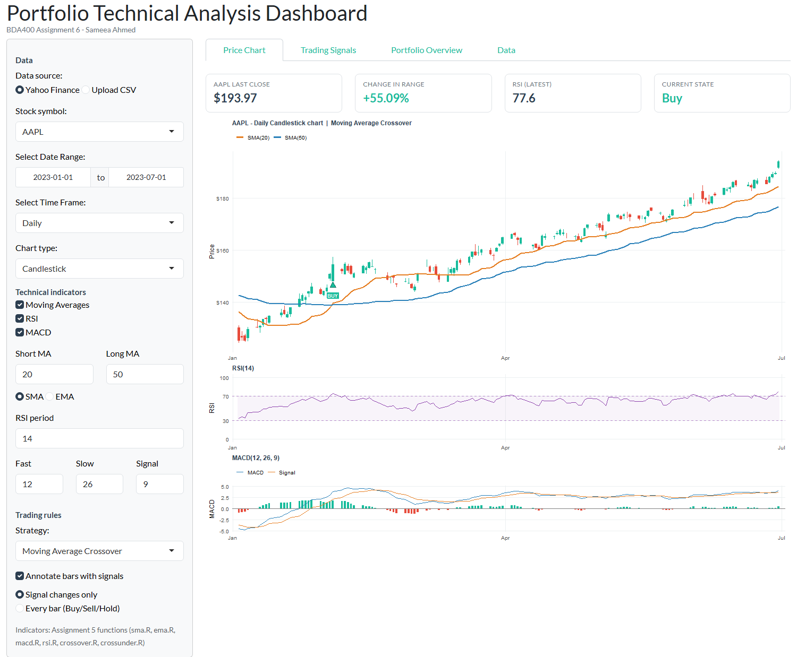
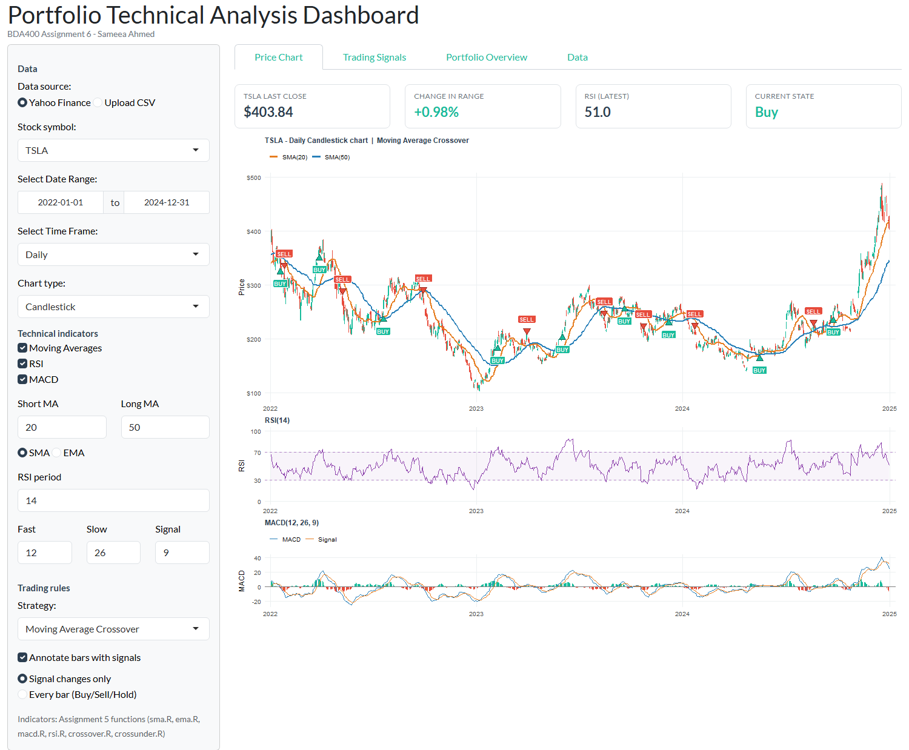
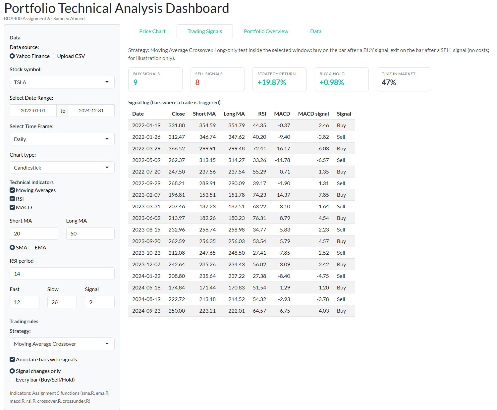

# BDA400 – Assignment 6: Technical Analysis using R, Visualization Phase

| | |
|---|---|
| **Student** | Sameea Ahmed |
| **Course** | BDA400 – Data Science Tools and Techniques (CDI College) |
| **Assignment** | Assignment 6 – Technical Analysis using R, Visualization Phase (15%) |
| **Repository** | https://github.com/ahmed1sameea-art/TechnicalAnalysis |
| **This stage** | https://github.com/ahmed1sameea-art/TechnicalAnalysis/tree/main/Assignment6 |

## Project description

This is the third and final stage of my three-part Technical Analysis project.

- **Stage 1 (Assignment 2)** – loaded the portfolio in `portfolio.txt` (AAPL, MSFT, GOOGL, AMZN, TSLA) with `quantmod` and calculated basic statistics (`technical_analysis.R`).
- **Stage 2 (Assignment 5)** – wrote the technical indicator functions from scratch in base R (`sma.R`, `ema.R`, `macd.R`, `rsi.R`, `stoch_rsi.R`, `stdev.R`, `linreg.R`, `crossover.R`, `crossunder.R`).
- **Stage 3 (Assignment 6, this folder)** – an interactive **R Shiny portfolio dashboard** (`app.R`) that fetches stock data from Yahoo Finance, visualizes it, overlays the Stage 2 indicators and generates annotated Buy / Sell / Hold trading signals.

## Features (mapped to the assignment steps)

| Step | What the app does |
|---|---|
| **1. Data collection and setup** | Installs (if missing) and loads `shiny`, `ggplot2`, `quantmod`. Fetches historical OHLCV data from **Yahoo Finance** with `getSymbols()`, or from an **uploaded CSV** as a second data source. Handles download errors, invalid tickers, missing prices (carried forward), duplicate dates and empty ranges with clear messages. Extra history is downloaded before the start date so indicators are warmed up on the first visible bar. |
| **2. Visualizing stock data** | Shiny app (`fluidPage` UI + server). Widgets: stock symbol (portfolio list or any typed ticker), `dateRangeInput`, time frame (Daily / Weekly / Monthly), chart type (**Candlestick, Line, Area, OHLC bars**). KPI cards show last close, change, latest RSI and current signal state. |
| **3. Overlay technical indicators** | Moving Averages (SMA or EMA, adjustable periods) drawn as layers on the price chart; **RSI** (with oversold/overbought band) and **MACD** (line, signal, histogram) drawn as aligned panels under the price. Each indicator is switched **on/off** with a checkbox. Uses my Assignment 5 functions (falls back to TTR only if those files are missing). |
| **4. Trading rules and annotations** | Four selectable rules: **Moving Average Crossover** (required rule: short MA crosses above long MA → Buy, below → Sell, otherwise Hold), RSI Overbought/Oversold, MACD Signal-Line Crossover, and MA Crossover + RSI filter. Parameters (MA periods, RSI levels, MACD periods) are customizable. Bars are annotated with **BUY ▲ / SELL ▼** labels, or with a Buy/Sell/Hold state for every bar. A *Trading Signals* tab lists every signal and compares a simple long-only back-test with buy-and-hold. |
| Extra | *Portfolio Overview* tab compares all portfolio stocks (rebased to 100) with each stock's current MA state; *Data* tab shows/downloads the computed data. |

## Screenshots







## How to run

1. Install R (≥ 4.1) and RStudio.
2. Clone or download this repository (keep `app.R` inside the `Assignment6` folder so it can find the Assignment 5 indicator files and `portfolio.txt` in the repository root).
3. Open `Assignment6/app.R` in RStudio and click **Run App**, or run from the repository root:

```r
shiny::runApp("Assignment6")
```

Missing packages (`shiny`, `ggplot2`, `quantmod`) are installed automatically the first time the app runs. An internet connection is needed for Yahoo Finance.

## Files

| File | Purpose |
|---|---|
| `app.R` | Complete Shiny dashboard, organised into sections for Steps 1–4 |
| `README.md` | This cover page |
| `screenshots/*.png` | Screenshots of the running dashboard with live Yahoo Finance data (AAPL, MSFT, TSLA and the full portfolio) |
| `screenshots/capture_screenshots.R` | Helper script that starts the app and captures the screenshots with headless Chrome (`chromote`) |
| `../sma.R`, `../ema.R`, `../macd.R`, `../rsi.R`, `../crossover.R`, `../crossunder.R` | Assignment 5 indicator functions used by the app |
| `../portfolio.txt` | Portfolio symbols (from Assignment 2) |

## AI Assistance Disclosure

The structure, UI layout, comments and this README were drafted with AI assistance (Claude) and reviewed by me. All prices, indicator values, signals and returns shown in the dashboard are calculated by R at run time from the downloaded data; the AI did not compute or supply any numeric results. Trading signals are for educational purposes only and are not investment advice.
